<div align="center">

# DPlex

**A desktop workspace for the AI CLI sessions you run every day.**

DPlex **discovers** every **Copilot CLI** / **Claude Code** session you've ever started, lets you **resume** any of them in one click, and **auto-restores every open session tab** the next time you open the app — splits, order, working directory, and resume command preserved. On top of that: the multiplexer essentials — split panes, tabs, projects, worktrees, and a built-in VSCode-style Source Control view.

[](https://github.com/Ron537/DPlex/actions/workflows/tests.yml)
[](https://github.com/Ron537/DPlex/actions/workflows/codeql.yml)
[](./LICENSE)
[](https://github.com/Ron537/DPlex/releases)
[](https://github.com/Ron537/DPlex/releases)
[](https://github.com/Ron537/DPlex/issues)
[](https://github.com/Ron537/DPlex/discussions)


[Quick install](#quick-install) · [Features](#features) · [Screenshots](#screenshots) · [How DPlex compares](#how-dplex-compares) · [Architecture](./docs/architecture.md) · [Add a provider](./docs/providers.md) · [Privacy](./PRIVACY.md) · [Contributing](./CONTRIBUTING.md)

</div>

<p align="center">
  <video src="https://raw.githubusercontent.com/Ron537/DPlex/main/docs/assets/demo.mp4" autoplay loop muted playsinline width="900" poster="./docs/assets/10-spaces-overview.png">
    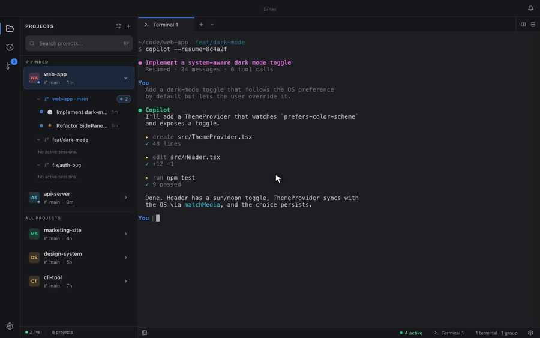
  </video>
</p>

<p align="center">
  <sub><a href="./docs/assets/demo.mp4">▶ Watch the crisp MP4</a> · <a href="./docs/assets/demo.gif">GIF version</a></sub>
</p>

> **🚧 Pre-1.0.** DPlex is functional and used daily by its author, but
> APIs, settings layout, and on-disk formats may shift between minor
> versions while we feel out the right shape. Please pin your version
> and read the [CHANGELOG](./CHANGELOG.md) before upgrading.

---

## Why DPlex?

When working with AI CLI tools across multiple projects, you end up with a mess of terminal windows — a Copilot session here, a Claude session there, plus regular shells scattered everywhere, and not a single one of them survives a reboot. DPlex gives you one home for all of it, with **AI session management as the headline feature**:

- **🗂️ Discover every past session.** DPlex reads each provider's data directory and surfaces every Copilot CLI / Claude Code session you've ever started — searchable by name, ID, summary, or workspace.
- **▶️ Resume in one click.** Click any past session and it opens in a new tab with the correct resume command and original CWD. No copy-pasting session IDs from `~/.copilot/...`.
- **⏹️ Close active sessions from the sidebar.** Stop running AI sessions without hunting for their terminal — closing a tab fully terminates the underlying process.
- **🗑️ Delete from disk.** Remove a session's stored data when you're done, with confirmation.
- **♻️ Auto-restore session tabs across restarts.** Quit the app, reopen it tomorrow — every AI session tab snaps back exactly where it was, with the right resume command, CWD, splits, and tab order preserved.
- **One window** for everything: split panes, tabs, and an activity bar (Projects · Sessions · Source Control).
- **Project-aware workflow** — group sessions by project, start a new AI session in any folder with one click.
- **Worktree-friendly** — first-class Git worktree support so concurrent feature work doesn't pollute your main checkout.
- **Built-in Source Control** — VSCode-style changes view scoped to whichever project (or worktree) you pick.
- **No telemetry. No analytics.** Read [PRIVACY.md](./PRIVACY.md) — it's a one-page promise, backed by `grep`-able source.

## Quick install

> **Note:** DPlex binaries are currently **unsigned** while we wait on
> Apple Developer / Windows code-signing certificates. The app is open
> source and the build is fully reproducible from source — see
> [Verify the build](#verify-the-build) below.

### macOS

```bash
# Apple Silicon
curl -L https://github.com/Ron537/DPlex/releases/latest/download/DPlex-arm64.dmg -o DPlex.dmg
# Intel
curl -L https://github.com/Ron537/DPlex/releases/latest/download/DPlex-x64.dmg -o DPlex.dmg

# Open the DMG, drag DPlex to /Applications, then on first launch:
xattr -dr com.apple.quarantine /Applications/DPlex.app
open /Applications/DPlex.app
```

The `xattr` line removes the macOS quarantine flag once you've inspected
the build — equivalent to right-clicking the app and choosing **Open**,
but cleaner from the terminal.

### Windows

Download `DPlex-Setup.exe` from the [Releases page](https://github.com/Ron537/DPlex/releases/latest)
and run it. SmartScreen will warn you about the unsigned installer —
click **More info → Run anyway** after verifying the file's SHA-256
matches the value published on the release page.

```powershell
Invoke-WebRequest -Uri https://github.com/Ron537/DPlex/releases/latest/download/DPlex-Setup.exe -OutFile DPlex-Setup.exe
.\DPlex-Setup.exe
```

### Linux

```bash
# AppImage (any distro)
curl -L https://github.com/Ron537/DPlex/releases/latest/download/DPlex.AppImage -o DPlex.AppImage
chmod +x DPlex.AppImage
./DPlex.AppImage

# Debian / Ubuntu
curl -LO https://github.com/Ron537/DPlex/releases/latest/download/DPlex-amd64.deb
sudo dpkg -i DPlex-amd64.deb
```

### Run from source

Requires **Node.js 18+** (we develop on 22 LTS) and Git.

```bash
git clone https://github.com/Ron537/DPlex.git
cd DPlex
npm install
npm run dev
```

### Build for distribution

```bash
npm run build:mac     # macOS .dmg + .zip (arm64 + x64)
npm run build:win     # Windows .exe installer
npm run build:linux   # Linux .AppImage + .deb + .snap
```

### Verify the build

Every release is built from a tagged commit by GitHub Actions. To
reproduce locally:

```bash
git checkout v0.9.0          # or whichever release you want
npm ci --ignore-scripts
npm run build
# Compare the SHA-256 of your local build with the release's published checksums.
```

CI logs and SBOMs are attached to every release.

## Screenshots

<table>
  <tr>
    <td align="center" colspan="2">
      <a href="./docs/assets/09-overview-dashboard.png">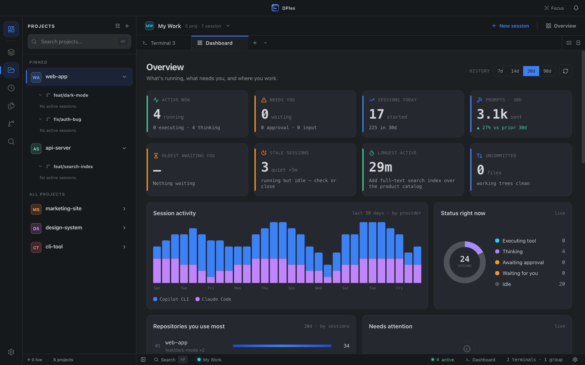</a>
      <br><sub><b>Overview dashboard.</b> A bird's-eye view of every AI session — what's running, what needs you, 30-day activity by provider, and the repos you work in most.</sub>
    </td>
  </tr>
  <tr>
    <td align="center" colspan="2">
      <a href="./docs/assets/10-spaces-overview.png">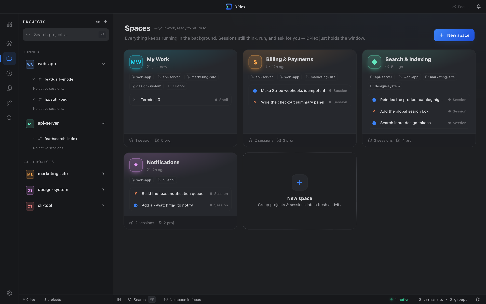</a>
      <br><sub><b>Spaces.</b> Mission control for your workspaces — group projects into separate spaces for client work, open source, or experiments, each keeping its sessions running in the background, and jump between them in a keystroke.</sub>
    </td>
  </tr>
  <tr>
    <td align="center" width="50%">
      <a href="./docs/assets/01-hero-projects.png">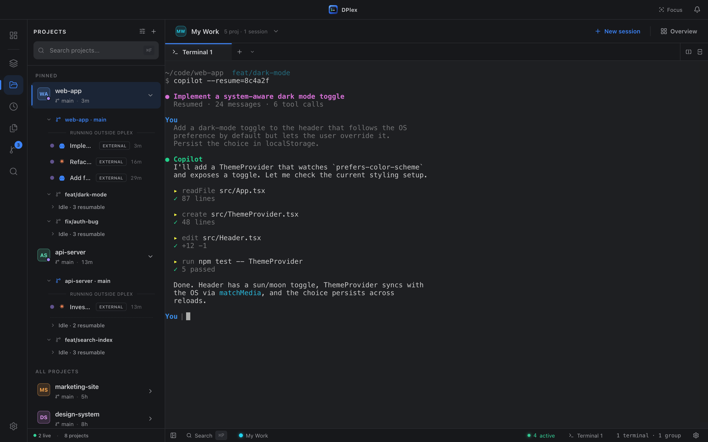</a>
      <br><sub><b>Projects view.</b> Pinned projects + worktrees + nested AI sessions, one click away.</sub>
    </td>
    <td align="center" width="50%">
      <a href="./docs/assets/02-sessions-panel.png">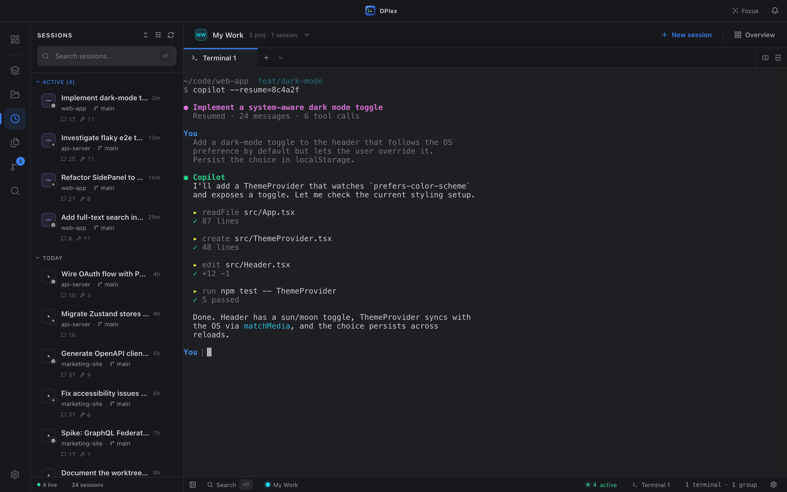</a>
      <br><sub><b>Sessions panel.</b> Every Copilot CLI / Claude Code session you've ever started, searchable. Click to resume, right-click to delete from disk.</sub>
    </td>
  </tr>
  <tr>
    <td align="center">
      <a href="./docs/assets/03-source-control.png">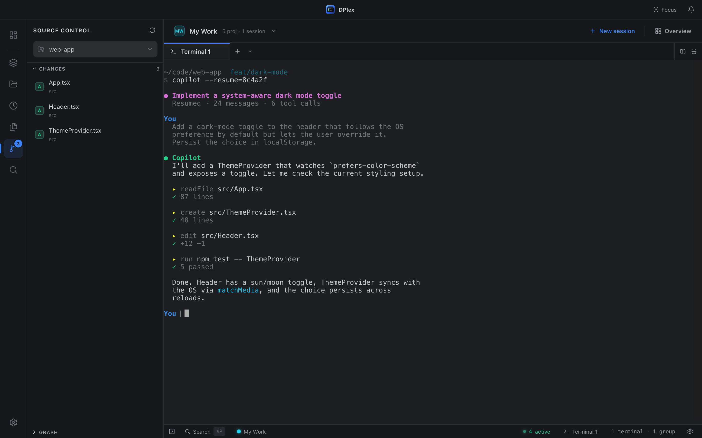</a>
      <br><sub><b>Source Control.</b> VSCode-style changes for the selected project — pick any worktree from the dropdown.</sub>
    </td>
    <td align="center">
      <a href="./docs/assets/06-project-picker.png">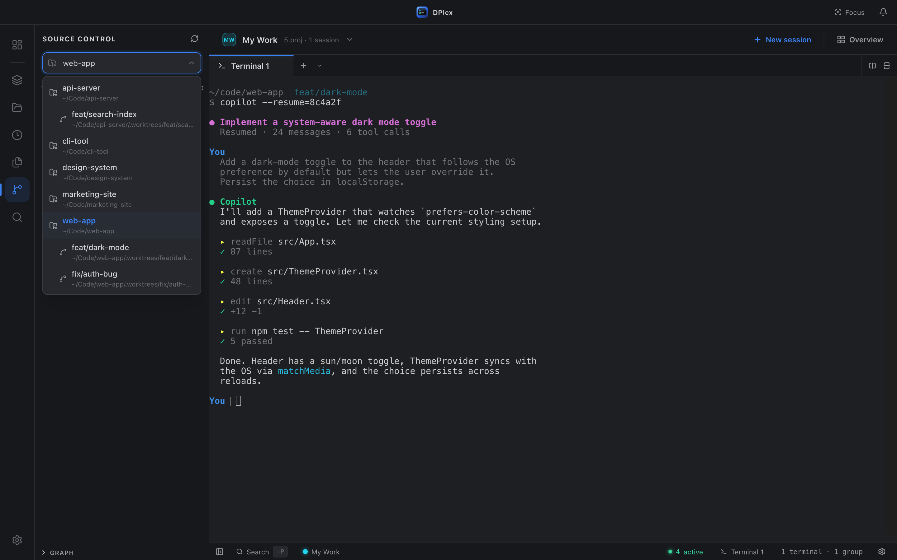</a>
      <br><sub><b>Project picker.</b> Switch the Source Control view to any project or worktree without leaving Git.</sub>
    </td>
  </tr>
  <tr>
    <td align="center">
      <a href="./docs/assets/07-split-screen.png">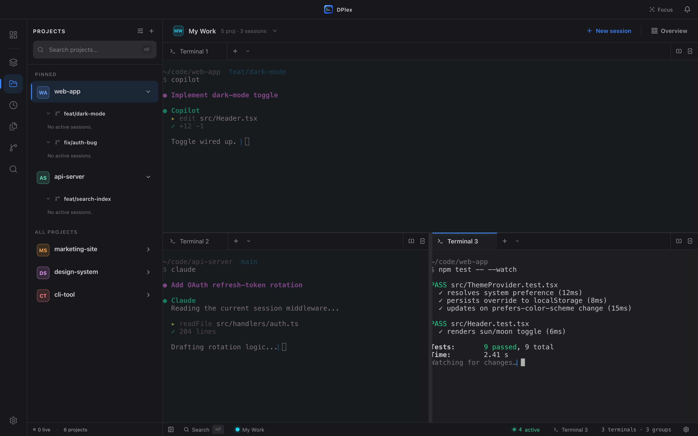</a>
      <br><sub><b>Splits & tabs.</b> Horizontal + vertical splits with multiple AI sessions running side-by-side.</sub>
    </td>
    <td align="center">
      <a href="./docs/assets/08-worktrees-settings.png">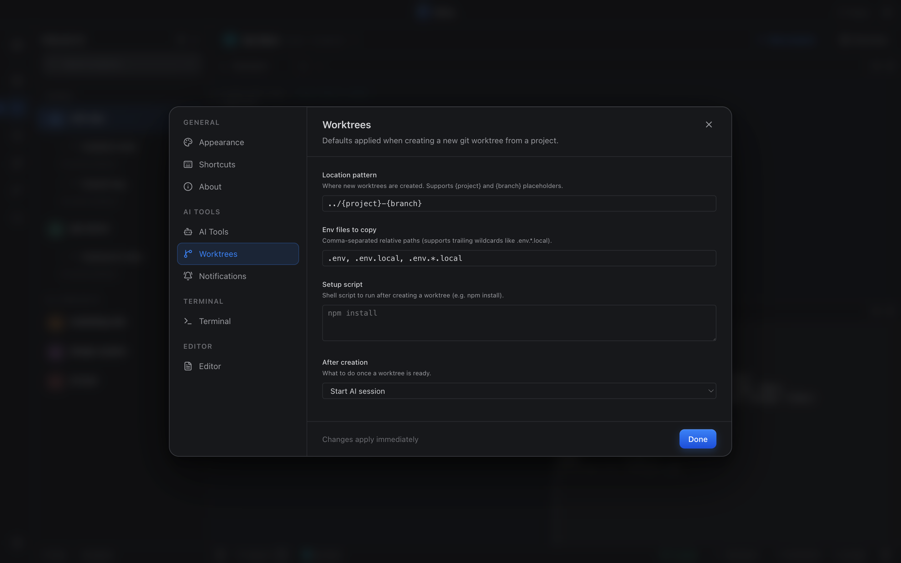</a>
      <br><sub><b>Worktree defaults.</b> Location pattern, env files, post-create scripts — set once, reused everywhere.</sub>
    </td>
  </tr>
  <tr>
    <td align="center">
      <a href="./docs/assets/04-settings-notifications.png">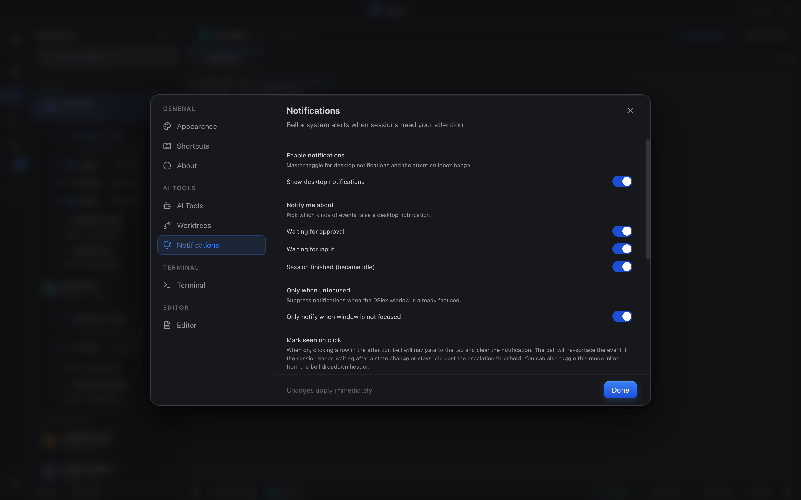</a>
      <br><sub><b>Notification controls.</b> Per-event toggles, Do Not Disturb, focus-aware suppression.</sub>
    </td>
    <td align="center">
      <a href="./docs/assets/05-light-theme.png">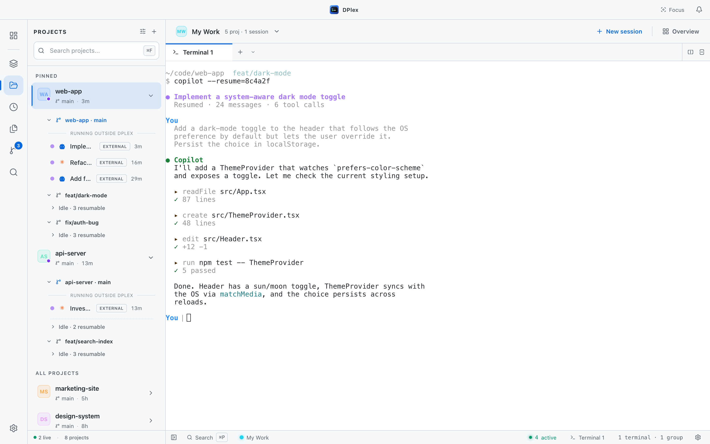</a>
      <br><sub><b>Light themes too.</b> GitHub Light, Solarized Light, Quiet Light — terminal palette and UI stay in sync.</sub>
    </td>
  </tr>
</table>

## Features

### AI session management

> The headline feature. DPlex gives you full lifecycle control over the
> Copilot CLI / Claude Code sessions you actually work with daily.

- **🗂️ Past-session list.** Every session you've ever started, surfaced
  in the **Sessions** activity-bar panel — searchable by name, ID,
  summary, or workspace, grouped by recency or by project.
- **▶️ One-click resume.** Click any past session to reopen it in a new
  tab with the correct resume command and original CWD pre-filled. The
  re-spawned PTY is matched back to its provider session ID so the
  active-session indicator lights up automatically once the AI tool
  writes its lock file.
- **🟢 Live active-session indicators.** Active sessions are detected
  via provider lock files (`inuse.<PID>.lock` for Copilot, pidfiles for
  Claude) with PID liveness checks, so the sidebar always reflects what
  is actually running.
- **⏹️ Close active sessions from the sidebar.** Stop a running AI
  session without finding its terminal — closing the tab fully
  terminates the underlying process.
- **🗑️ Delete sessions from disk.** Remove a session's stored history
  when you're done with it (with confirmation).
- **🧠 Prompt-history viewer.** Browse and search the prompts you've
  sent in any past session — useful for re-running, copy-pasting, or
  remembering what you asked yesterday.
- **📌 Recent sessions per project.** Each expanded project (and
  worktree) lists its last few idle sessions inline, so you can resume
  them without leaving the projects panel.
- **🧩 Provider-agnostic.** Same start / resume / close / delete flow
  whether the underlying tool is Copilot CLI, Claude Code, or one you
  add yourself — see [docs/providers.md](./docs/providers.md).

### Workspace persistence (auto-restore on restart)

> **Close the app today, open it tomorrow — every AI session tab is
> back exactly where you left it.** This is the feature DPlex was built
> around.

- **Every AI session tab is restored.** Tabs are serialized to
  `sessions.json` in the Electron `userData` directory on every natural
  lifecycle event and synchronously on quit, so a SIGTERM doesn't lose
  state.
- **Splits and tab order survive too.** Horizontal/vertical splits, tab
  order within each pane, the active group, and the active tab are all
  rebuilt on launch.
- **Resume command + CWD preserved.** Each restored tab is recreated
  with its original resume command and working directory. A short retry
  loop re-resolves the underlying provider session ID once the AI tool
  writes its lock file, so active-session indicators light up
  automatically.
- **History is independent of workspace state.** Even after a hard kill
  (SIGKILL/OOM) the session *history* is untouched — every previous
  session is still discoverable and resumable from the Sessions panel.

### Activity bar — Projects · Sessions · Source Control

- **VSCode-style activity bar** on the far left. One click jumps between projects, sessions, and git changes.
- **Click the active item to collapse the panel** for maximum editor space.
- **Settings gear** at the bottom of the activity bar for quick access.

### Multi-provider AI sessions

- **Provider-agnostic architecture.** Built-in support for **GitHub Copilot CLI** and **Anthropic Claude Code** out of the box.
- **One interface for all providers.** Same start / resume / close flow regardless of the underlying tool.
- **Pluggable.** Add a provider by implementing one TypeScript interface — see [docs/providers.md](./docs/providers.md). PRs welcome.
- **Auto-detection.** Sessions remember which provider they belong to so resume commands are always correct.

### Terminal multiplexer

- **Split panes** — horizontal and vertical splits with resizable dividers.
- **Tabbed interface** — multiple terminals per pane, drag tabs between panes.
- **Tab reordering** — drag and drop within and across groups.
- **Drag a tab onto another pane's edge** to create a new split right there — handy for putting a freshly-resumed AI session next to the one you already had open.
- **Shell selector** — pick from auto-detected system shells (bash, zsh, fish, PowerShell, etc.) when opening a new terminal.

### Project management

- **Project sidebar** with active session indicators and Git branch badge.
- **One-click AI sessions** in any project directory.
- **Pinned projects** float to the top, with an "All projects" section below.
- **Drag-and-drop reordering** for projects.
- **Quick actions** — open terminal, copy path, remove project from the right-click menu.
- **Git worktrees** — create, manage, remove worktrees per project, with worktree-specific session lists. Worktrees are first-class projects in the sidebar.

### Source Control

- **Project-scoped changes view** — file list for whichever project (or worktree) you've selected.
- **Header dropdown** to switch projects without leaving Git.
- **Single-click preview** + **double-click promotes to a permanent diff tab** (VSCode behavior).
- **Live updates** via filesystem watchers — changes appear as you save.

### Attention inbox

- **Notification bell** — aggregated inbox surfaces sessions that need you, with an unread badge in the title bar.
- **Event kinds** — separate signals for *waiting for approval*, *waiting for input*, and *finished*.
- **Auto-dismiss on focus** — events clear when you focus the relevant tab.
- **Configurable cooldown** — tune how often a session can re-notify to avoid noise.
- **Jump-to-session** — click any inbox entry to activate its tab.

### Theming

12 built-in themes with matched terminal and UI colors:

- **Dark** — DPlex, Dark, Midnight, Dracula, Monokai, Nord, Solarized Dark, GitHub Dark.
- **Light** — DPlex Light, GitHub Light, Solarized Light, Quiet Light.

### Keyboard shortcuts

| Shortcut | Action                       |
| -------- | ---------------------------- |
| `⌘T`     | New terminal                 |
| `⌘W`     | Close terminal               |
| `⌘B`     | Toggle sidebar               |
| `⌘,`     | Open settings                |
| `⌘\`     | Split horizontal             |
| `⌘⇧\`    | Split vertical               |
| `⌘⇧G`    | Toggle Source Control view   |
| `⌘F`     | Focus side-panel search      |
| `⌘1-9`   | Switch to tab N              |

(`⌘` = `Ctrl` on Linux/Windows.)

## How DPlex compares

There are great tools in adjacent niches. DPlex isn't trying to replace any of them — it's optimizing for one specific workflow: **running multiple AI CLI sessions across multiple projects without losing your place.**

| Tool                       | Niche                                  | Where it differs from DPlex                                                                            |
| -------------------------- | -------------------------------------- | ------------------------------------------------------------------------------------------------------ |
| **tmux** / **Zellij**      | Terminal multiplexer, server-side      | Powerful but generic; no AI-tool awareness, no project sidebar, no session discovery.                  |
| **Warp**                   | AI-augmented terminal                  | Beautiful, but the AI is *theirs*, not the CLI tool you already use. Closed source.                    |
| **iTerm2** / **WezTerm**   | Best-in-class terminal emulators       | More polished as terminals; no orchestration of external AI sessions.                                  |
| **VS Code terminal panel** | Embedded terminals in the IDE          | Fine for ad-hoc shells; not designed for managing many concurrent AI sessions across many repos.       |
| **Wave Terminal**          | AI-focused terminal                    | Adjacent vision; broader scope, more opinionated UI. DPlex is narrower and Electron-portable today.    |
| **Zed / Cursor**           | AI-native editors                      | They embed the AI in the editor; DPlex orchestrates the AI you already use from the terminal.          |

If your goal is "I want to start a Claude session in repo A today, a Copilot session in repo B tomorrow, find yesterday's sessions whenever I need them, resume any of them in one click, and reopen the app next week with every tab right where I left it" — that's DPlex.

## FAQ / Troubleshooting

**My AI tool isn't being detected.**
Check that the binary is on the same `$PATH` your default shell sees. DPlex spawns its PTYs via your login shell, so anything missing from `~/.zprofile` or `~/.bashrc` won't be found.

**An AI session shows as inactive even though it's running.**
DPlex detects active sessions via the tool's lock files (`inuse.<PID>.lock` for Copilot, pidfiles for Claude). If the tool's lock format changed in an upstream release, please open an issue with your version + OS — usually a one-line fix in the provider.

**My session tabs didn't restore after a crash.**
Workspace state is saved on graceful quit and during natural lifecycle events; a hard kill (SIGKILL, OOM) can lose unsaved tabs. The session *history* is unaffected — your past sessions are still discoverable from the Sessions list.

**The app won't open on macOS — "DPlex is damaged" or "from an unidentified developer."**
Until proper notarization lands, run:

```bash
xattr -dr com.apple.quarantine /Applications/DPlex.app
```

…or right-click the app and choose **Open**. macOS remembers your choice after the first launch.

**The Windows installer is flagged by SmartScreen.**
Until code signing lands: click **More info → Run anyway** after verifying the SHA-256 matches the release page. The installer is unmodified from CI.

**I want feature X / I'd like a provider for tool Y.**
[Open an issue](https://github.com/Ron537/DPlex/issues/new/choose). For new providers there's a dedicated template — see [docs/providers.md](./docs/providers.md) if you want to send a PR.

## Architecture

DPlex uses `electron-vite` with three process targets — main (Node), preload (IPC bridge), and renderer (React).

For the deep dive — security posture, state stores, terminal lifecycle, IPC pattern, and provider system — see [**docs/architecture.md**](./docs/architecture.md).

## Tech stack

| Layer       | Technology                                                                  |
| ----------- | --------------------------------------------------------------------------- |
| Framework   | Electron 39                                                                 |
| Build       | electron-vite + Vite 7                                                      |
| Frontend    | React 19, TypeScript 5.9                                                    |
| Styling     | Tailwind CSS v4                                                             |
| State       | Zustand 5                                                                   |
| Terminal    | xterm.js 6 (with WebGL, fit, web-links addons)                              |
| PTY         | node-pty                                                                    |
| Icons       | lucide-react                                                                |
| Packaging   | electron-builder + electron-updater                                         |
| Tests       | Vitest (unit) + Playwright (e2e + monkey)                                   |

## Contributing

Contributions are very welcome. Read [**CONTRIBUTING.md**](./CONTRIBUTING.md) for the dev setup, conventions, and PR checklist.

The fastest way to expand DPlex's reach is **implementing a new provider** — see [docs/providers.md](./docs/providers.md). Bug reports with reproduction steps are equally valuable.

Looking for something to start with? Browse [issues labelled `good first issue`](https://github.com/Ron537/DPlex/labels/good%20first%20issue).

## Privacy & security

- **No telemetry, ever.** Read [PRIVACY.md](./PRIVACY.md) — it's auditable.
- Report security issues privately per [SECURITY.md](./SECURITY.md).

## License

DPlex is open source under the [MIT License](./LICENSE).

---

<div align="center">
  <sub>Built with ❤️ by developers who got tired of having 14 terminal windows open.</sub>
</div>
